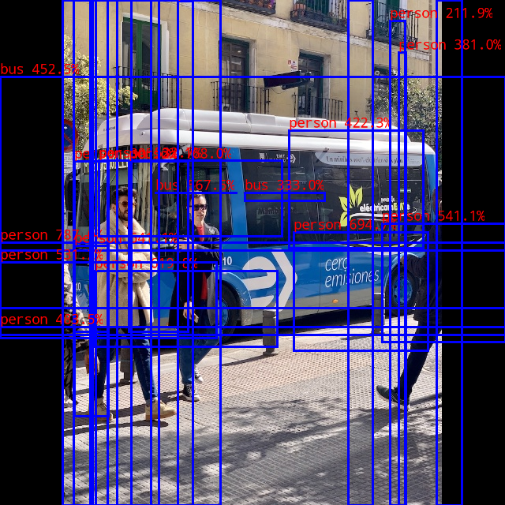

- [1. 常见问题](#1-常见问题)
  - [1.1 如何升级 RKNPU 的相关依赖库](#11-如何升级-rknpu-的相关依赖库)
  - [1.2 不同平台推理结果不同](#12-不同平台推理结果不同)
  - [1.3 demo推理结果不对](#13-demo推理结果不对)
  - [1.4 demo跑对了，但换成自己的模型跑错了](#14-demo跑对了但换成自己的模型跑错了)
  - [1.5 模型推理性能达不到参考性能](#15-模型推理性能达不到参考性能)
  - [1.6 如何解决模型量化掉精度问题](#16-如何解决模型量化掉精度问题)
  - [1.7 是否有板端 python demo](#17-是否有板端-python-demo)
  - [1.8 为什么其他模型没有demo，是因为不支持吗](#18-为什么其他模型没有demo是因为不支持吗)
  - [1.9 是否有大模型demo](#19-是否有大模型demo)
  - [1.10 为什么RV1103、RV1106能跑的demo较少](#110-为什么rv1103rv1106能跑的demo较少)
- [2. RGA](#2-rga)
- [3. YOLO](#3-yolo)
  - [3.1 类别置信度超过1](#31-类别置信度超过1)
  - [3.2 推理结果出现框非常多，填满了整个图的情况](#32-推理结果出现框非常多填满了整个图的情况)
  - [3.3 框的位置、置信度是对的，但是框和物体不贴合(yolov5, yolov7)](#33-框的位置置信度是对的但是框和物体不贴合yolov5-yolov7)
  - [3.4 MAP精度相比官方的结果低一些](#34-map精度相比官方的结果低一些)
  - [3.5 如果不修改YOLO模型结构，NPU可以跑吗](#35-如果不修改yolo模型结构npu可以跑吗)

## 1. 常见问题

### 1.1 如何升级 RKNPU 的相关依赖库

|              | RKNPU1                                                       | RKNPU2                                                       |
| ------------ | ------------------------------------------------------------ | ------------------------------------------------------------ |
| 对应平台     | RV1109 RV1126 RK1808 RK3399pro                | RV1103 RV1106 RK3562 RK3566 RK3568 RK3588 RK3576 |
| 驱动         | 通过更新.ko文件升级                                          | 通过更新固件升级                                             |
| runtime      | 参考[文档](https://github.com/airockchip/rknpu/blob/master/README.md)，替换 librknn_runtime.so 及其相关依赖文件升级 (如果需要使用python连板调试功能，请同步更新文档中涉及的 rknn_server 文件) | 参考[文档](https://github.com/rockchip-linux/rknn-toolkit2/blob/master/doc/rknn_server_proxy.md)，替换 librknnrt.so 文件升级 (RV1103/RV1106 使用裁剪版本的 runtime，对应文件名称为 librknnmrt.so) (如果需要使用 python 连板调试功能，请同步更新文档中涉及的 rknn_server 文件) |
| RKNN-Toolkit | 参考[文档](https://github.com/airockchip/rknn-toolkit/blob/master/README.md)，安装新的 python whl 文件升级 | 参考[文档](https://github.com/rockchip-linux/rknn-toolkit2/blob/master/doc/02_Rockchip_RKNPU_User_Guide_RKNN_SDK_V1.6.0_CN.pdf) 2.1小节，安装新的 python whl 文件升级 |

- 请注意，由于开发板的规格差异，固件通常是互不兼容的，请联系开发板的购买来源获取新固件及烧录方法。

### 1.2 不同平台推理结果不同

受NPU代次影响，推理结果有略微差异是正常现像，如果差异很大，请提issue反馈。

### 1.3 demo推理结果不对

请检查驱动、runtime.so、RKNN-Toolkit 的版本是否满足[文档](README_CN.md)罗列的版本要求。

### 1.4 demo跑对了，但换成自己的模型跑错了

请检查在导出模型时，是否有按照demo文档要求的进行。例如 yolov5 demo，要求按照[文档](./examples/yolov5/README.md)的要求基于 https://github.com/airockchip/yolov5 仓库导出 onnx 模型。

### 1.5 模型推理性能达不到参考性能

以下因素可能导致推理性能有差异:

- python api 的推理性能会较弱一些，请基于 CAPI 测试性能。

- rknn model zoo 的推理性能数据不包含前后处理，只统计 rknn.run 的耗时，与完整demo的耗时是存在差异的。这些操作的耗时与使用场景、系统资源占用有关，这部分数据请用户基于实际环境进行测试。
- 板子是否已经定频、并且达到了[定频脚本](./scaling_frequency.sh)设定的最高频率。部分固件可能限制了CPU/NPU/DDR的最高频率，导致推理性能有所减弱。
- 是否有其他应用占用了 CPU/NPU 及带宽资源，这会导致推理性能减弱。
- 对于有大小核CPU的芯片(目前为RK3588, RK3576)，测试时请参考[文档](https://github.com/rockchip-linux/rknn-toolkit2/blob/master/doc/02_Rockchip_RKNPU_User_Guide_RKNN_SDK_V1.6.0_CN.pdf)的5.3.3小节，绑定CPU大核进行测试。

### 1.6 如何解决模型量化掉精度问题

根据平台版本，先参考 [RKNN-Toolkit1文档](https://github.com/airockchip/rknn-toolkit/blob/master/doc/Rockchip_User_Guide_RKNN_Toolkit_V1.7.5_CN.pdf) 、 [RKNN-Toolkit2文档](https://github.com/airockchip/rknn-toolkit2/blob/master/doc/02_Rockchip_RKNPU_User_Guide_RKNN_SDK_V1.6.0_CN.pdf) 确认量化功能的使用是否正确。

如果是模型结构特性、权重分布导致 int8 量化掉精度，请考虑使用混合量化或QAT量化。

### 1.7 是否有板端 python demo

在板端安装 RKNN-Toolkit-lite，使用对应 demo 的 python 推理脚本，将 `from rknn.api import RKNN` 修改为 `from rknnlite.api import RKNNLite as RKNN` 就可以实现板端的 python 推理。RKNPU1 平台请使用 [RKNN-Toolkit-lite](https://github.com/airockchip/rknn-toolkit/tree/master/rknn-toolkit-lite)，RKNPU2 平台请使用 [RKNN-Toolkit-lite2](https://github.com/airockchip/rknn-toolkit2/tree/master/rknn_toolkit_lite2)。

（部份示例目前暂缺 python demo，此外更推荐在意性能的用户使用C接口进行部署）

### 1.8 为什么其他模型没有demo，是因为不支持吗

不是。受限于开发周期，为了照顾大部分开发者的需求，我们挑选了实用性较高的模型作为demo示例。如果有更好的模型推荐，欢迎提issue或其他渠道联系 RKNPU 部门开发者。

### 1.9 是否有大模型demo

目前没有。对 transformer 模型的支持目前还在逐步优化中，我们也希望能尽早提供大模型demo给开发者参考、使用。

### 1.10 为什么RV1103、RV1106能跑的demo较少

受限于RV1103、RV1106的内存大小限制，很多模型的内存占用较大，超出板端内存限制，故暂不提供对应的demo 。

## 2. RGA

RGA相关问题请参考[RGA文档](https://github.com/airockchip/librga/blob/main/docs/Rockchip_FAQ_RGA_CN.md)。

## 3. YOLO

### 3.1 类别置信度超过1

YOLO模型的后处理代码和模型导出结构需要匹配，否则会出现异常。当前YOLO demo使用的后处理，要求模型的类别置信度输出的由 sigmoid op 产生，sigmoid op将 (-∞, ∞) 的置信度调整为 (0, 1) 的置信度，缺乏该 sigmoid op 会导致类别置信度大于 1，示意图如下：

碰到此类问题时，请参考对应demo文档说明的方式进行模型导出。

### 3.2 推理结果出现框非常多，填满了整个图的情况

如上图所示，出现这种问题有两种可能：

- 第一种情况同3.1小节，模型尾部缺失 sigmoid op可能会导致此问题。
- 第二种是demo配置的 box threashold 数值太小、nms threshold 数值太大导致。

### 3.3 框的位置、置信度是对的，但是框和物体不贴合(yolov5, yolov7)

这种情况通常是 anchor 不匹配导致的。请在导出模型时，留意打印的 anchor 信息是否与 demo 中默认的 anchor 配置不一致。

### 3.4 MAP精度相比官方的结果低一些

主要有两个原因：

- 官方测map时，使用动态shape模型；而rknn model zoo为了简单易用性，使用了固定shape模型，map测试结果会比动态shape的低一些。
- RKNN 模型在开启量化后，也会有一部分精度损失。
- 如果用户尝试在板端使用 C接口测试map结果，请注意读取图片的方式会影响测试结果，例如基于 cv2 和 stbi 测试map结果时不同。 

### 3.5 如果不修改YOLO模型结构，NPU可以跑吗

可以，但不推荐。

如果不修改模型结构，python demo, Cdemo 对应的后处理代码需要自行调整。

此外模型结构的调整方式是经过了精度、性能考量的。保持原模型结构，可能会面临量化精度不佳、推理性能更差的问题。

