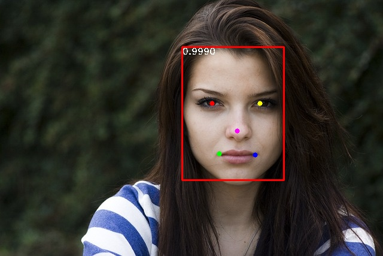

# RetinaFace

## Current Support Platform
RK3566, RK3568, RK3588, RK3562, RK1808, RV1109, RV1126

## Model Source
The model used in this example comes from the following open source projects:
https://github.com/biubug6/Pytorch_Retinaface

Download link: 

[RetinaFace_mobile320.onnx](https://ftrg.zbox.filez.com/v2/delivery/data/95f00b0fc900458ba134f8b180b3f7a1/examples/RetinaFace/RetinaFace_mobile320.onnx)<br />[RetinaFace_resnet50_320.onnx](https://ftrg.zbox.filez.com/v2/delivery/data/95f00b0fc900458ba134f8b180b3f7a1/examples/RetinaFace/RetinaFace_resnet50_320.onnx)

Download with shell command:

```
cd model
./download_model.sh
```


## (Optional) Convert original model to ONNX model
Refer to convert_to_onnx.py provided by the original project to convert the onnx file. The command is as follows:
```
python3 convert_to_onnx.py -m ./weights/mobilenet0.25_Final.pth --network mobile0.25 --long_side 320 
```


## Convert ONNX model to RKNN model

```
cd python
python convert.py <onnx_model> <TARGET_PLATFORM> <dtype(optional)> <output_rknn_path(optional)>
# such as: python convert.py ../model/RetinaFace_mobile320.onnx rk3566
# output model will be saved as ../model/RetinaFace.rknn
```
*Description:*

- <onnx_model> should be the ONNX model path.
- <TARGET_PLATFORM>  could be specified as RK3562, RK3566, RK3568, RK3588, RK1808, RV1109, RV1126 according to board SOC version.
- <dtype\> is *optional*, could be specified as `i8` or `u8`, `i8`/`u8` means to do quantization, default is `i8`/`u8`.
- <output_rknn_path> is *optional*, used to specify the saving path of the RKNN model, default save path is `../model/RetinaFace.rknn`


## Python Demo

*Usage:*

```shell
cd python
# Inference with RKNN model
python RetinaFace.py --model_path <rknn_model> --target <TARGET_PLATFORM>
# The inference result will be saved as the image result.jpg.
```
*Description:*
- <TARGET_PLATFORM>: Specified as the NPU platform name. Such as 'rk3588'.
- <rknn_model>: Specified as the model path.


## Android Demo
**Note: RK1808, RV1109, RV1126 does not support Android.**

### Compiling && Building

Modify the path of Android NDK in 'build-android.sh'.

For example,

```sh
export ANDROID_NDK_PATH=~/opt/toolchain/android-ndk-r18b
```

Then, run this script:

```sh
./build-android.sh -t <TARGET_PLATFORM> -a arm64-v8a -d RetinaFace
```
Please use the specific platform instead of <TARGET_PLATFORM> above.

### Push all build output file to the board

Connect the USB port to PC, then push all demo files to the board.

```sh
adb root
adb push install/<TARGET_PLATFORM>_android_arm64-v8a/rknn_RetinaFace_demo/ /data/
```

### Running

```sh
adb shell
cd /data/rknn_RetinaFace_demo/

export LD_LIBRARY_PATH=./lib
./rknn_retinaface_demo model/RetinaFace.rknn model/test.jpg
```

## Aarch64 Linux Demo

### Compiling && Building

According to the target platform, modify the path of 'GCC_COMPILER' in 'build-linux.sh'.

```sh
export GCC_COMPILER=/opt/linux-x86/aarch64/gcc-linaro-6.3.1-2017.05-x86_64_aarch64-linux-gnu/bin/aarch64-linux-gnu
```

Then, run the script:

```sh
./build-linux.sh  -t <TARGET_PLATFORM> -a aarch64 -d RetinaFace
```

Please use the specific platform instead of <TARGET_PLATFORM> above.

### Push all build output file to the board


Push install/rknn_RetinaFace_demo_<TARGET_PLATFORM>_linux_aarch64 to the board,<br>
- If use adb via the EVB board:

```
adb push install/<TARGET_PLATFORM>_linux_aarch64/rknn_RetinaFace_demo /userdata/
```

- For other boards, use the scp or other different approaches to push all files under install/rknn_RetinaFace_demo_<TARGET_PLATFORM>_linux_aarch64 to '/userdata'.
<br>
Please use the specific platform instead of <TARGET_PLATFORM> above.

### Running

```sh
adb shell
cd /userdata/rknn_RetinaFace_demo/

export LD_LIBRARY_PATH=./lib
./rknn_retinaface_demo model/RetinaFace.rknn model/test.jpg
```
Note: Try searching the location of librga.so and add it to LD_LIBRARY_PATH if the librga.so is not found in the lib folder.
Use the following command to add it to LD_LIBRARY_PATH.

```sh
export LD_LIBRARY_PATH=./lib:<LOCATION_LIBRGA>
```

## Expected Results
This example will print the labels and corresponding scores of the test image detect results, as follows:
```
face @(302 76 476 300) score=0.999512
```



- Note: Different platforms, different versions of tools and drivers may have slightly different results.

## C DEMO Notes
1. For the generation of BOX_PRIORS_320 and BOX_PRIORS_640 in C demo post-processing, please refer to the PriorBox function in python/RetinaFace.py. This function aims to pre-generate the anchors box parameters. In order to speed up the demo post-processing, the C code directly generates the array.
2. In C demo post-processing, num_priors is the number of anchor boxes. When the model shape is 320x320, num_priors is 4200. When the model shape is 640x640, num_priors is 16800.