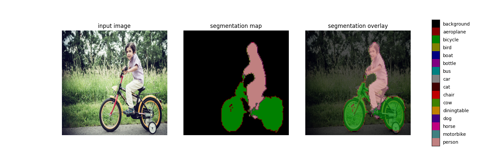

# Deeplabv3

## Model Source
Download link: 

[deeplab-v3-plus-mobilenet-v2.pb](https://ftrg.zbox.filez.com/v2/delivery/data/95f00b0fc900458ba134f8b180b3f7a1/examples/Deeplabv3/deeplab-v3-plus-mobilenet-v2.pb)

Download with shell command

```shell
cd model
./download_model.sh
```

## Convert to RKNN

*Usage:*

```shell
cd python
python convert.py <tensorFlow_model> <TARGET_PLATFORM> <dtype(optional)> <output_rknn_path(optional)>

# such as: python convert.py ../model/deeplab-v3-plus-mobilenet-v2.pb rk3588
# output model will be saved as ../model/deeplab-v3-plus-mobilenet-v2.rknn
```

*Description:*
- <tensorFlow_model> should be the TensorFlow model path.
- <TARGET_PLATFORM>  could be specified as RK3562, RK3566, RK3568, RK3588, RK1808, RV1109, RV1126 according to board SOC version.
- <dtype\> is *optional*, could be specified as `i8`, `u8` or `fp`, `i8`/`u8` means to do quantization, `fp` means no to do quantization, default is `i8`/`u8`.
- <output_rknn_path> is *optional*, used to specify the saving path of the RKNN model, default save in the same directory as TensorFlow model with name `deeplab-v3-plus-mobilenet-v2.rknn`.


## Python Demo
*Usage:*

```shell
cd python
python deeplabv3.py --model_path <rknn_model> --target <TARGET_PLATFORM>
# such as: python deeplabv3.py ../model/deeplab-v3-plus-mobilenet-v2.pb rk3566
# output model will be saved as ../model/deeplab-v3-plus-mobilenet-v2.rknn
```
*Description:*
- <TARGET_PLATFORM>: Specified as the NPU platform name. Such as 'rk3588'.
- <rknn_model>: Specified as the model path.


**Note**: Due to post-processing for reszie and argmax, the model needs to be cropped to run on the C demo. This is shown below by python scripts.

```py
rknn.load_tensorflow(ori_model, 
                        inputs=['sub_7'],
                        outputs=['logits/semantic/BiasAdd'],
                        input_size_list=[[1,513,513,3]])
```

Where `logits/semantic/BiasAdd` are selected as output node for deeplabv3 model rather than the original model output node.

*Expected Results*

This example will print the segmentation result on the testing image, as follows:




## Android Demo
**Note: RK1808, RV1109, RV1126 does not support Android.**

### Compiling && Building

Please refer to the [Compilation_Environment_Setup_Guide](../../docs/Compilation_Environment_Setup_Guide.md#android-platform) document to setup a cross-compilation environment and complete the compilation of C/C++ Demo.
**Note: Please replace the model name with `deeplabv3`.**

### Push all build output file to the board

Connect the USB port to PC, then push all demo files to the board.

For example, on RK3588,

```
adb root
adb remount
adb push install/rk3588_android_arm64-v8a/rknn_deeplabv3_demo/ /data/
```

### Running

```shell
adb shell

cd /data/rknn_deeplabv3_demo/lib/

# cp libOpenCL.so to lib
cp /vendor/lib64/libOpenCL.so .

# go to demo path
cd /data/rknn_deeplabv3_demo/


export LD_LIBRARY_PATH=./lib
./rknn_deeplabv3_demo ./model/deeplab-v3-plus-mobilenet-v2.rknn model/test_image.jpg
```
Note: The segmentation results will be saved in the `out.png`.


## Aarch64 Linux Demo

### Compiling && Building

Please refer to the [Compilation_Environment_Setup_Guide](../../docs/Compilation_Environment_Setup_Guide.md#linux-platform) document to setup a cross-compilation environment and complete the compilation of C/C++ Demo.
**Note: Please replace the model name with `deeplabv3`.**


### Push all build output file to the board


Push install/<TARGET_PLATFORM>_linux_aarch64/rknn_deeplabv3_demo/ to the board.

- If use adb via the EVB board：

```shell
adb push install/<TARGET_PLATFORM>_linux_aarch64/rknn_deeplabv3_demo/ /data
```

- For other boards, use the scp or other different approaches to push all files under install/rknn_Deeplabv3_demo_<TARGET_PLATFORM>_linux_aarch64 to '/userdata'.

**Please use the specific platform instead of <TARGET_PLATFORM> above and make sure that there is a libOpenCL.so on the '/usr/lib' path or somewhere else on the board!**

### Running

```shell
adb shell
cd /data/rknn_deeplabv3_demo/

export LD_LIBRARY_PATH=./lib
./rknn_deeplabv3_demo model/deeplab-v3-plus-mobilenet-v2.rknn model/test_image.jpg
```

**For error message: can't find libOpenCL.so**

This error can be fixed by creating a soft link to ARM mali library **/usr/lib/aarch64-linux-gnu/libmali.so.1.9.0**

```shell
ln -s /usr/lib/aarch64-linux-gnu/libmali.so.1.9.0 libOpenCL.so
```

Then copy libOpenCL.so to path of your lib in demo and run it again.   
Note: **If the libmali.so cannot be found on the path of /usr/lib, please try to search this library in whole system or upgrade firmware to make sure there is a file named libmali.so on the board.**

Note: **RK1808, RV1109, and RV1126 platforms do not have a GPU. The CPP demo under the `cpp/rknpu1` folder do not use GPU implementation, so there won't be an issue of not finding libOpenCL.so.**

## Notes

**if user wants to use other deeplabv3 model with differrnt size, please modify the following variables.**

```C++
// Modify it accroding to required label for your model
const size_t NUM_LABEL = 21;  
```

Also. if user need to have different color table for converting model output to RGB or other color space, the FULL_COLOR_MAP should be modified according to your color table used in the post-processing. 


## Expected Results

The expected result comes from C Demo.


Note: Different platforms, different versions of tools and drivers may have slightly different results.
