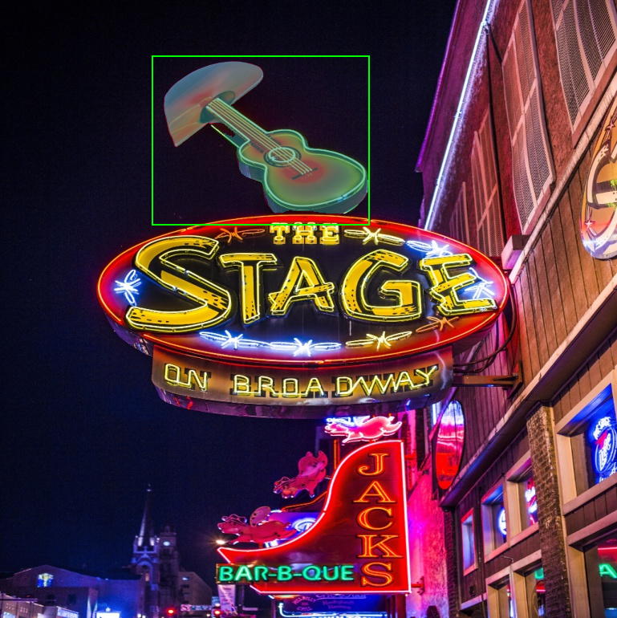

# mobilesam

## Table of contents

- [mobilesam](#mobilesam)
  - [Table of contents](#table-of-contents)
  - [1. Description](#1-description)
  - [2. Current Support Platform](#2-current-support-platform)
  - [3. Pretrained Model](#3-pretrained-model)
  - [4. Convert to RKNN](#4-convert-to-rknn)
  - [5. Python Demo](#5-python-demo)
  - [6. Android Demo](#6-android-demo)
      - [6.1 Compile and Build](#61-compile-and-build)
      - [6.2 Push demo files to device](#62-push-demo-files-to-device)
      - [6.3 Run demo](#63-run-demo)
  - [7. Linux Demo](#7-linux-demo)
      - [7.1 Compile and Build](#71-compile-and-build)
      - [7.2 Push demo files to device](#72-push-demo-files-to-device)
      - [7.3 Run demo](#73-run-demo)
  - [8. Expected Results](#8-expected-results)


## 1. Description

The Segment Anything Model (SAM) produces high quality object masks from input prompts such as points or boxes, and it can be used to generate masks for all objects in an image. MobileSAM performs on par with the original SAM (at least visually) and keeps exactly the same pipeline as the original SAM except for a change on the image encoder.

The model used in this example comes from the following open source projects:
https://github.com/airockchip/MobileSAM, which fork from https://github.com/ChaoningZhang/MobileSAM


## 2. Current Support Platform

RK3562, RK3576, RK3588, RV1126B


## 3. Pretrained Model

Download link: 

[./mobilesam_encoder_tiny.onnx](https://ftrg.zbox.filez.com/v2/delivery/data/95f00b0fc900458ba134f8b180b3f7a1/examples/mobilesam/mobilesam_encoder_tiny.onnx)<br />
[./mobilesam_decoder.onnx](https://ftrg.zbox.filez.com/v2/delivery/data/95f00b0fc900458ba134f8b180b3f7a1/examples/mobilesam/mobilesam_decoder.onnx)

Download with shell command:

```
cd model
./download_model.sh
```


## 4. Convert to RKNN

*Usage:*

```shell
cd python
python convert.py <onnx_model> <TARGET_PLATFORM> <output_rknn_path(optional)>

# such as: 
python convert.py ../model/mobilesam_encoder_tiny.onnx rk3588
# output model will be saved as ../model/mobilesam_encoder_tiny.rknn
```

*Description:*

- `<onnx_model>`: Specify ONNX model path.
- `<TARGET_PLATFORM>`: Specify NPU platform name. Support Platform refer [here](#2-current-support-platform).
- `<output_rknn_path>(optional)`: Specify save path for the RKNN model, default save in the same directory as ONNX model with name `mobilesam_encoder_tiny.rknn`

*Note:*

Regarding the deployment of RKNN and the export of ONNX models， please refer:

[RKNN_README_CN.md](https://github.com/airockchip/MobileSAM/blob/master/RKNN_README_CN.md)

[RKNN_README_EN.md](https://github.com/airockchip/MobileSAM/blob/master/RKNN_README_EN.md)


## 5. Python Demo

*Usage:*

```shell
cd python

# Inference with RKNN model
python mobilesam.py --encoder <rknn_model> --decoder <rknn_model> --target <TARGET_PLATFORM>
```
*Description:*
- <TARGET_PLATFORM>: Specify NPU platform name. Such as 'rk3576'.
- <rknn_model>: specified as the model path.
- <point_coords>: point inputs and box inputs.Boxes are encoded using two points, one for the top-left corner and one for the bottom-right corner, such as points and boxes: [[400, 400], [0, 0]] and [[190, 70], [460, 280]]
- <point_labels>: 0 is a negative input point, 1 is a positive input point, 2 is a top-left box corner, 3 is a bottom-right box corner, and -1 is a padding point, if there is no box input, a single padding point with label -1 and point_coords (0.0, 0.0) should be concatenated.
- <mask_input>: Mask input path to the model, .npy format. Default is zeros.

*Note：*

If you want to get the coordinates of point or box in an image, you can use the `get_point_coords.py` or `get_box_coords.py`. Here's how to use it:

```sh
python get_point_coords.py
# Click on the coordinates of a point you need in the image, the point coordinates will be printed.

python get_box_coords.py
# Click on the starting point of the box in the image, then drag the mouse to you need box, the box coordinates: top-left and bottom-right will be printed.
```


## 6. Android Demo

#### 6.1 Compile and Build

*Usage:*

```sh
# go back to the rknn_model_zoo root directory
cd ../../
export ANDROID_NDK_PATH=<android_ndk_path>

./build-android.sh -t <TARGET_PLATFORM> -a <ARCH> -d mobilesam

# such as 
./build-android.sh -t rk3588 -a arm64-v8a -d mobilesam
```

*Description:*
- `<android_ndk_path>`: Specify Android NDK path.
- `<TARGET_PLATFORM>`: Specify NPU platform name. Support Platform refer [here](#2-current-support-platform).
- `<ARCH>`: Specify device system architecture. To query device architecture, refer to the following command:
	```shell
	# Query architecture. For Android, ['arm64-v8a' or 'armeabi-v7a'] should shown in log.
	adb shell cat /proc/version
	```

#### 6.2 Push demo files to device

With device connected via USB port, push demo files to devices:

```shell
adb root
adb remount
adb push install/<TARGET_PLATFORM>_android_<ARCH>/rknn_mobilesam_demo/ /data/
```

#### 6.3 Run demo

```sh
adb shell
cd /data/rknn_mobilesam_demo

export LD_LIBRARY_PATH=./lib
./rknn_mobilesam_demo mobilesam_encoder_tiny_fp16.rknn model/picture.jpg mobilesam_decoder_fp16.rknn model/coords.txt model/labels.txt
```

*Description:*
- model/coords.txt: point inputs and box inputs.Boxes are encoded using two points, one for the top-left corner and one for the bottom-right corner
- model/labels.txt: 0 is a negative input point, 1 is a positive input point, 2 is a top-left box corner, 3 is a bottom-right box corner, and -1 is a padding point, if there is no box input, a single padding point with label -1 and point_coords (0.0, 0.0) should be concatenated.

- After running, the result was saved as out.png. To check the result on host PC, pull back result referring to the following command: 

  ```sh
  adb pull /data/rknn_mobilesam_demo/out.png
  ```


## 7. Linux Demo

#### 7.1 Compile and Build

*usage*

```shell
# go back to the rknn_model_zoo root directory
cd ../../

# if GCC_COMPILER not found while building, please set GCC_COMPILER path
(optional)export GCC_COMPILER=<GCC_COMPILER_PATH>

./build-linux.sh -t <TARGET_PLATFORM> -a <ARCH> -d mobilesam

# such as 
./build-linux.sh -t rk3588 -a aarch64 -d mobilesam
```

*Description:*

- `<GCC_COMPILER_PATH>`: Specified as GCC_COMPILER path.
- `<TARGET_PLATFORM>` : Specify NPU platform name. Support Platform refer [here](#2-current-support-platform).
- `<ARCH>`: Specify device system architecture. To query device architecture, refer to the following command: 
  
  ```shell
  # Query architecture. For Linux, ['aarch64' or 'armhf'] should shown in log.
  adb shell cat /proc/version
  ```

#### 7.2 Push demo files to device

- If device connected via USB port, push demo files to devices:

```shell
adb push install/<TARGET_PLATFORM>_linux_<ARCH>/rknn_mobilesam_demo/ /userdata/
```

- For other boards, use `scp` or other approaches to push all files under `install/<TARGET_PLATFORM>_linux_<ARCH>/rknn_mobilesam_demo/` to `userdata`.

#### 7.3 Run demo

```sh
adb shell
cd /userdata/rknn_mobilesam_demo

export LD_LIBRARY_PATH=./lib
./rknn_mobilesam_demo mobilesam_encoder_tiny_fp16.rknn model/picture.jpg mobilesam_decoder_fp16.rknn model/coords.txt model/labels.txt
```

*Description:*
- model/coords.txt: point inputs and box inputs.Boxes are encoded using two points, one for the top-left corner and one for the bottom-right corner
- model/labels.txt: 0 is a negative input point, 1 is a positive input point, 2 is a top-left box corner, 3 is a bottom-right box corner, and -1 is a padding point, if there is no box input, a single padding point with label -1 and point_coords (0.0, 0.0) should be concatenated.

- After running, the result was saved as out.png. To check the result on host PC, pull back result referring to the following command: 

  ```
  adb pull /userdata/rknn_mobilesam_demo/out.png
  ```


## 8. Expected Results

This example will print the labels and corresponding scores of the test image detect results, as follows:


<br>

- Note: Different platforms, different versions of tools and drivers may have slightly different results.