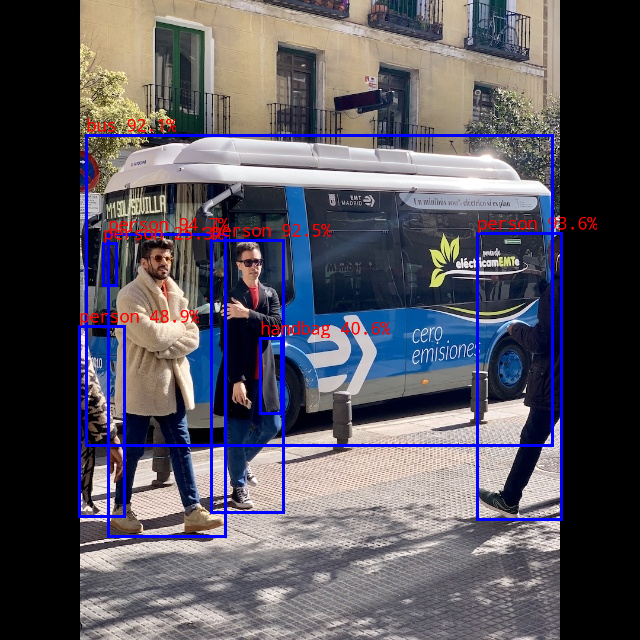

# ppyoloe

## Table of contents

- [1. Description](#1-description)
- [2. Current Support Platform](#2-current-support-platform)
- [3. Pretrained Model](#3-pretrained-model)
- [4. Convert to RKNN](#4-convert-to-rknn)
- [5. Python Demo](#5-python-demo)
- [6. Android Demo](#6-android-demo)
  - [6.1 Compile and Build](#61-compile-and-build)
  - [6.2 Push demo files to device](#62-push-demo-files-to-device)
  - [6.3 Run demo](#63-run-demo)
- [7. Linux Demo](#7-linux-demo)
  - [7.1 Compile and Build](#71-compile-and-build)
  - [7.2 Push demo files to device](#72-push-demo-files-to-device)
  - [7.3 Run demo](#73-run-demo)
- [8. Expected Results](#8-expected-results)


## 1. Description

The model used in this example comes from the following open source projects:  

https://github.com/PaddlePaddle/PaddleDetection/blob/release/2.6/configs/ppyoloe

- To export the model matching this demo requirement,  refer [here](./patch_for_model_export/README_EN.md) to export ONNX model.


## 2. Current Support Platform

RK3566, RK3568, RK3588, RK3562, RK1808, RV1109, RV1126


## 3. Pretrained Model

Download link: 

[./ppyoloe_s.onnx](https://ftrg.zbox.filez.com/v2/delivery/data/95f00b0fc900458ba134f8b180b3f7a1/examples/ppyoloe/ppyoloe_s.onnx)<br />[./ppyoloe_m.onnx](https://ftrg.zbox.filez.com/v2/delivery/data/95f00b0fc900458ba134f8b180b3f7a1/examples/ppyoloe/ppyoloe_m.onnx)

Download with shell command:

```
cd model
./download_model.sh
```


## 4. Convert to RKNN

*Usage:*

```shell
cd python
python convert.py <onnx_model> <TARGET_PLATFORM> <dtype(optional)> <output_rknn_path(optional)>

# such as: 
python convert.py ../model/ppyoloe_s.onnx rk3588
# output model will be saved as ../model/ppyoloe.rknn
```

*Description:*

- `<onnx_model>`: Specify ONNX model path.
- `<TARGET_PLATFORM>`: Specify NPU platform name. Support Platform refer [here](#2 Current Support Platform).
- `<dtype>(optional)`: Specify as `i8`, `u8` or `fp`. `i8`/`u8` for doing quantization, `fp` for no quantization. Default is `i8`.
- `<output_rknn_path>(optional)`: Specify save path for the RKNN model, default save in the same directory as ONNX model with name `ppyoloe.rknn`


## 5. Python Demo

*Usage:*

```shell
cd python
# Inference with PyTorch model or ONNX model
python ppyoloe.py --model_path <pt_model/onnx_model> --img_show

# Inference with RKNN model
python ppyoloe.py --model_path <rknn_model> --target <TARGET_PLATFORM> --img_show
```

*Description:*

- `<TARGET_PLATFORM>`: Specify NPU platform name. Support Platform refer [here](#2 Current Support Platform).

- `<pt_model / onnx_model / rknn_model>`: Specify the model path.


## 6. Android Demo

**Note: RK1808, RV1109, RV1126 does not support Android.**

#### 6.1 Compile and Build

Please refer to the [Compilation_Environment_Setup_Guide](../../docs/Compilation_Environment_Setup_Guide.md#android-platform) document to setup a cross-compilation environment and complete the compilation of C/C++ Demo.  
**Note: Please replace the model name with `ppyoloe`.**

#### 6.2 Push demo files to device

With device connected via USB port, push demo files to devices:

```shell
adb root
adb remount
adb push install/<TARGET_PLATFORM>_android_<ARCH>/rknn_ppyoloe_demo/ /data/
```

#### 6.3 Run demo

```sh
adb shell
cd /data/rknn_ppyoloe_demo

export LD_LIBRARY_PATH=./lib
./rknn_ppyoloe_demo model/ppyoloe.rknn model/bus.jpg
```

- After running, the result was saved as `out.png`. To check the result on host PC, pull back result referring to the following command: 

  ```sh
  adb pull /data/rknn_ppyoloe_demo/out.png
  ```


## 7. Linux Demo

#### 7.1 Compile and Build

Please refer to the [Compilation_Environment_Setup_Guide](../../docs/Compilation_Environment_Setup_Guide.md#linux-platform) document to setup a cross-compilation environment and complete the compilation of C/C++ Demo.  
**Note: Please replace the model name with `ppyoloe`.**

#### 7.2 Push demo files to device

- If device connected via USB port, push demo files to devices:

```shell
adb push install/<TARGET_PLATFORM>_linux_<ARCH>/rknn_ppyoloe_demo/ /userdata/
```

- For other boards, use `scp` or other approaches to push all files under `install/<TARGET_PLATFORM>_linux_<ARCH>/rknn_ppyoloe_demo/` to `userdata`.

#### 7.3 Run demo

```sh
adb shell
cd /userdata/rknn_ppyoloe_demo

export LD_LIBRARY_PATH=./lib
./rknn_ppyoloe_demo model/ppyoloe.rknn model/bus.jpg
```

- After running, the result was saved as `out.png`. To check the result on host PC, pull back result referring to the following command: 

  ```
  adb pull /userdata/rknn_ppyoloe_demo/out.png
  ```


## 8. Expected Results

This example will print the labels and corresponding scores of the test image detect results, as follows:

```
person @ (108 234 225 536) 0.947
person @ (477 233 561 519) 0.936
person @ (211 240 283 512) 0.925
bus @ (86 135 552 445) 0.921
person @ (79 326 124 516) 0.489
handbag @ (260 338 281 413) 0.406
person @ (103 243 116 285) 0.253
```



- Note: Different platforms, different versions of tools and drivers may have slightly different results.
