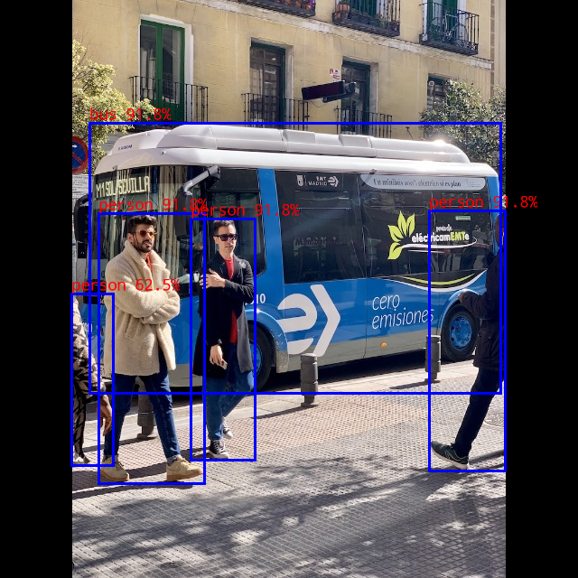

# yolo_world

## Table of contents

- [yolo\_world](#yolo_world)
  - [Table of contents](#table-of-contents)
  - [1. Description](#1-description)
  - [2. Current Support Platform](#2-current-support-platform)
  - [3. Pretrained Model](#3-pretrained-model)
  - [4. Convert to RKNN](#4-convert-to-rknn)
  - [5. Python Demo](#5-python-demo)
  - [6. Android Demo](#6-android-demo)
      - [6.1 Compile and Build](#61-compile-and-build)
      - [6.2 Push demo files to device](#62-push-demo-files-to-device)
      - [6.3 Run demo](#63-run-demo)
  - [7. Linux Demo](#7-linux-demo)
      - [7.1 Compile and Build](#71-compile-and-build)
      - [7.2 Push demo files to device](#72-push-demo-files-to-device)
      - [7.3 Run demo](#73-run-demo)
  - [8. Expected Results](#8-expected-results)


## 1. Description
The model used in this example comes from the following open source projects:
https://github.com/AILab-CVC/YOLO-World


## 2. Current Support Platform

RK3566, RK3568, RK3588, RK3562, RK3576


## 3. Pretrained Model

Download link: 

[./yolo_world_v2s.onnx](https://ftrg.zbox.filez.com/v2/delivery/data/95f00b0fc900458ba134f8b180b3f7a1/examples/yolo_world/yolo_world_v2s.onnx)<br />
[./clip_text.onnx](https://ftrg.zbox.filez.com/v2/delivery/data/95f00b0fc900458ba134f8b180b3f7a1/examples/yolo_world/clip_text.onnx)

Download with shell command:

```
cd model
./download_model.sh
```


## 4. Convert to RKNN

*Usage:*

```shell
cd python
python convert.py <onnx_model> <TARGET_PLATFORM> <dtype(optional)> <output_rknn_path(optional)>

# such as: 
python convert.py ../model/yolo_world_v2s.onnx rk3588
# output model will be saved as ../model/yolo_world_v2s.rknn
```

*Description:*

- `<onnx_model>`: Specify ONNX model path.
- `<TARGET_PLATFORM>`: Specify NPU platform name. Support Platform refer [here](#2-current-support-platform).
- `<dtype>(optional)`: Specify as `i8` or `fp`. `i8` for doing quantization, `fp` for no quantization. yolo_world model default is `i8`, clip_text only support `fp`.
- `<output_rknn_path>(optional)`: Specify save path for the RKNN model, default save in the same directory as ONNX model with name `yolo_world_v2s.rknn`


## 5. Python Demo

*Usage:*

```shell
cd python

# Inference with RKNN model
python yolo_world.py --text_model <rknn_model> --yolo_world <rknn_model> --target <TARGET_PLATFORM>
```
*Description:*
- <TARGET_PLATFORM>: Specify NPU platform name. Such as 'rk3576'.
- <rknn_model>: specified as the model path.


## 6. Android Demo

#### 6.1 Compile and Build

*Usage:*

```sh
# go back to the rknn_model_zoo root directory
cd ../../
export ANDROID_NDK_PATH=<android_ndk_path>

./build-android.sh -t <TARGET_PLATFORM> -a <ARCH> -d yolo_world

# such as 
./build-android.sh -t rk3588 -a arm64-v8a -d yolo_world
```

*Description:*
- `<android_ndk_path>`: Specify Android NDK path.
- `<TARGET_PLATFORM>`: Specify NPU platform name. Support Platform refer [here](#2-current-support-platform).
- `<ARCH>`: Specify device system architecture. To query device architecture, refer to the following command:
	```shell
	# Query architecture. For Android, ['arm64-v8a' or 'armeabi-v7a'] should shown in log.
	adb shell cat /proc/version
	```

#### 6.2 Push demo files to device

With device connected via USB port, push demo files to devices:

```shell
adb root
adb remount
adb push install/<TARGET_PLATFORM>_android_<ARCH>/rknn_yolo_world_demo/ /data/
```

#### 6.3 Run demo

```sh
adb shell
cd /data/rknn_yolo_world_demo

export LD_LIBRARY_PATH=./lib
./rknn_yolo_world_demo clip_text_fp16.rknn model/detect_classes.txt yolo_world_v2s_i8.rknn model/bus.jpg
```

- After running, the result was saved as out.png. To check the result on host PC, pull back result referring to the following command: 

  ```sh
  adb pull /data/rknn_yolo_world_demo/out.png
  ```


## 7. Linux Demo

#### 7.1 Compile and Build

*usage*

```shell
# go back to the rknn_model_zoo root directory
cd ../../

# if GCC_COMPILER not found while building, please set GCC_COMPILER path
(optional)export GCC_COMPILER=<GCC_COMPILER_PATH>

./build-linux.sh -t <TARGET_PLATFORM> -a <ARCH> -d yolo_world

# such as 
./build-linux.sh -t rk3588 -a aarch64 -d yolo_world
```

*Description:*

- `<GCC_COMPILER_PATH>`: Specified as GCC_COMPILER path.
- `<TARGET_PLATFORM>` : Specify NPU platform name. Support Platform refer [here](#2-current-support-platform).
- `<ARCH>`: Specify device system architecture. To query device architecture, refer to the following command: 
  
  ```shell
  # Query architecture. For Linux, ['aarch64' or 'armhf'] should shown in log.
  adb shell cat /proc/version
  ```

#### 7.2 Push demo files to device

- If device connected via USB port, push demo files to devices:

```shell
adb push install/<TARGET_PLATFORM>_linux_<ARCH>/rknn_yolo_world_demo/ /userdata/
```

- For other boards, use `scp` or other approaches to push all files under `install/<TARGET_PLATFORM>_linux_<ARCH>/rknn_yolo_world_demo/` to `userdata`.

#### 7.3 Run demo

```sh
adb shell
cd /userdata/rknn_yolo_world_demo

export LD_LIBRARY_PATH=./lib
./rknn_yolo_world_demo clip_text_fp16.rknn model/detect_classes.txt yolo_world_v2s_i8.rknn model/bus.jpg
```

- After running, the result was saved as out.png. To check the result on host PC, pull back result referring to the following command: 

  ```
  adb pull /userdata/rknn_yolo_world_demo/out.png
  ```


## 8. Expected Results

This example will print the labels and corresponding scores of the test image detect results, as follows:
```
person @ (475 233 559 521) 0.918
person @ (109 236 226 535) 0.918
bus @ (99 136 554 435) 0.918
person @ (211 242 282 509) 0.918
person @ (79 325 125 515) 0.625

```


<br>

- Note: Different platforms, different versions of tools and drivers may have slightly different results.
