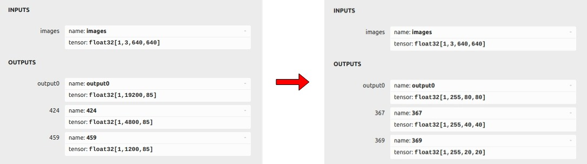
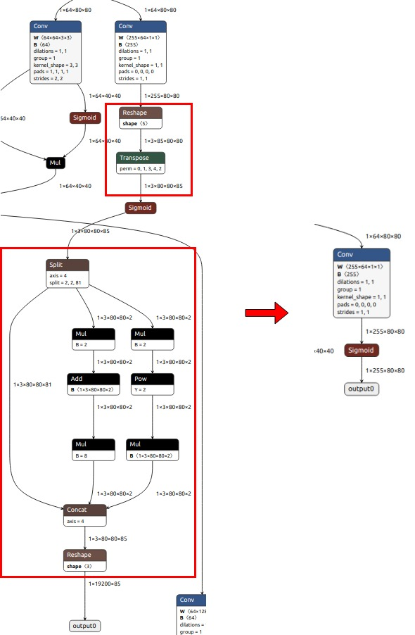
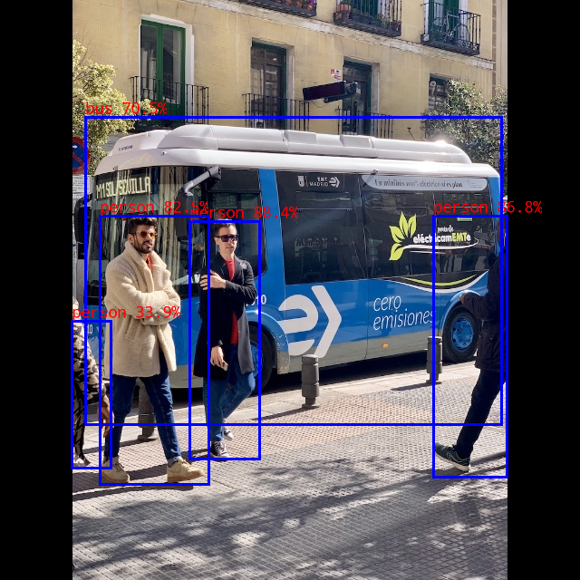

# yolov5

## Model Source
The model used in this example comes from the following open source projects:  
https://github.com/airockchip/yolov5


## Pretrained Model

Download link: 

[yolov5n.onnx](https://ftrg.zbox.filez.com/v2/delivery/data/95f00b0fc900458ba134f8b180b3f7a1/examples/yolov5/yolov5n.onnx)<br />[yolov5s_relu.onnx](https://ftrg.zbox.filez.com/v2/delivery/data/95f00b0fc900458ba134f8b180b3f7a1/examples/yolov5/yolov5s_relu.onnx)<br />[yolov5s.onnx](https://ftrg.zbox.filez.com/v2/delivery/data/95f00b0fc900458ba134f8b180b3f7a1/examples/yolov5/yolov5n.onnx)<br />[yolov5m.onnx](https://ftrg.zbox.filez.com/v2/delivery/data/95f00b0fc900458ba134f8b180b3f7a1/examples/yolov5/yolov5m.onnx)

Download with shell command:

```
cd model
./download_model.sh
```

**Note**: The model provided here is an optimized model, which is different from the official original model. Take yolov5n.onnx as an example to show the difference between them.
1. The comparison of their output information is as follows. The left is the official original model, and the right is the optimized model.

<div align=center>
  
</div>

2. Taking the output change [1,19200,85]->[1,255,80,80] as an example, we delete a subgraph (the framed part in the picture) from the model and put it in post-processing (this subgraph is not quantification-friendly)

<div align=center>
  
</div>

## Current Support Platform

RK3562, RK3566, RK3568, RK3588, RV1103, RV1106, RK1808, RV1109, RV1126


## Convert to RKNN

*Usage:*

```shell
cd python
python convert.py <onnx_model> <TARGET_PLATFORM> <dtype(optional)> <output_rknn_path(optional)>

# such as: 
python convert.py ../model/yolov5s_relu.onnx rk3566
# output model will be saved as ../model/yolov5.rknn
```

*Description:*

- <onnx_model> should be the ONNX model path.
- <TARGET_PLATFORM>:  Specify NPU platform name. Such as 'rk3588'.
- <quant_dtype> is *optional*, could be specified as `i8`/`u8` or `fp`. `i8`/`u8` means to do quantization, `fp` means no quantization, default is `i8`.
- <output_rknn_path> is *optional*, used to specify the saving path of the RKNN model, default save in the same directory as ONNX model with name 'yolov5.rknn'


## Python Demo

*Usage:*

```shell
cd python
# Inference with PyTorch model or ONNX model
python yolov5.py --model_path <pt_model/onnx_model> --img_show

# Inference with RKNN model
python yolov5.py --model_path <rknn_model> --target <TARGET_PLATFORM> --img_show
```
*Description:*
- <TARGET_PLATFORM>: Specify NPU platform name. Such as 'rk3588'.

- <pt_model / onnx_model / rknn_model>: specified as the model path.


## Android Demo

**Note: RK1808, RV1109, RV1126 does not support Android.**

### Compiling && Building

Please refer to the [Compilation_Environment_Setup_Guide](../../docs/Compilation_Environment_Setup_Guide.md#android-platform) document to setup a cross-compilation environment and complete the compilation of C/C++ Demo.  
**Note: Please replace the model name with `yolov5`.**

### Push demo files to device

With device connected via USB port, push demo files to devices:

```shell
adb root
adb remount
adb push install/<TARGET_PLATFORM>_android_<ARCH>/rknn_yolov5_demo/ /data/
```

### Running

```sh
adb shell
cd /data/rknn_yolov5_demo

export LD_LIBRARY_PATH=./lib
./rknn_yolov5_demo model/yolov5.rknn model/bus.jpg
```

- After running. The result was saved as ./out.png. Pull to check the result.

  ```
  adb pull /data/rknn_yolov5_demo/out.png .
  ```


## Linux Demo

### Compiling && Building

Please refer to the [Compilation_Environment_Setup_Guide](../../docs/Compilation_Environment_Setup_Guide.md#linux-platform) document to setup a cross-compilation environment and complete the compilation of C/C++ Demo.  
**Note: Please replace the model name with `yolov5`.**

### Push demo files to device

```shell
adb push install/<TARGET_PLATFORM>_linux_<ARCH>/rknn_yolov5_demo/ /data/
```

### Running

```sh
adb shell
cd /data/rknn_yolov5_demo

export LD_LIBRARY_PATH=./lib
./rknn_yolov5_demo model/yolov5.rknn model/bus.jpg
```

- RV1106/1103 LD_LIBRARY_PATH must fill in an absolute path. such as 

  ```sh
  export LD_LIBRARY_PATH=/data/rknn_yolov5_demo/lib
  ```

- After running. The result was saved as ./out.png. Pull to check the result

  ```sh
  adb pull /data/rknn_yolov5_demo/out.png .
  ```

  

## Expected Results

This example will print the labels and corresponding scores of the test image detect results, as follows:
```
person @ (209 244 286 506) 0.884
person @ (478 238 559 526) 0.868
person @ (110 238 230 534) 0.825
bus @ (94 129 553 468) 0.705
person @ (79 354 122 516) 0.339
```


<br>
- Note: Different platforms, different versions of tools and drivers may have slightly different results.

