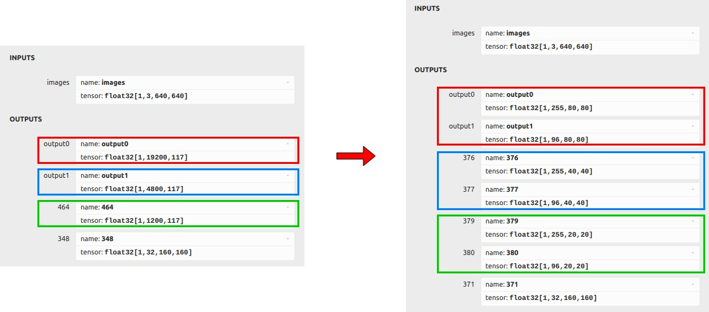
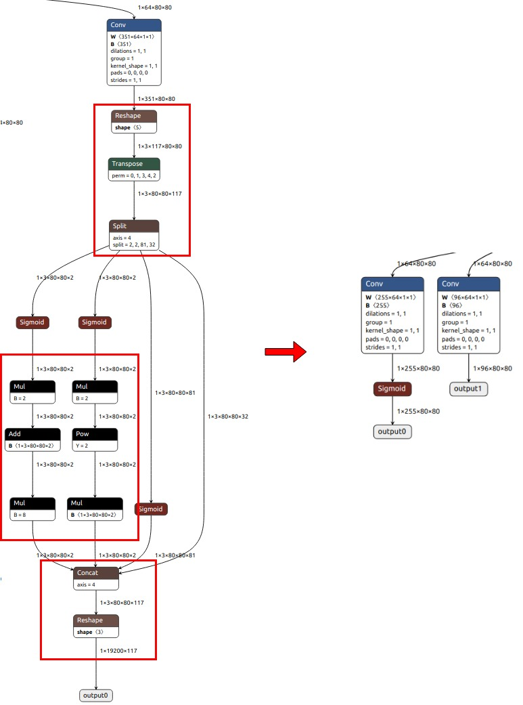
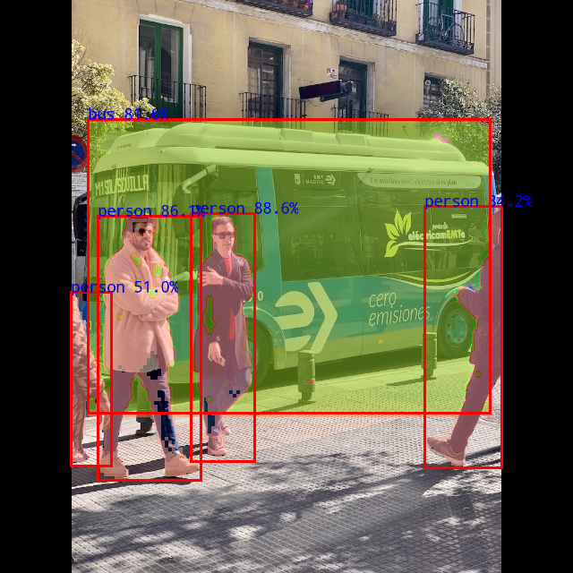

# yolov5_seg

## Current Support Platform
RK3566, RK3568, RK3588, RK3562, RK1808, RV1109, RV1126


## Model Source
The model used in this example comes from the following open source projects:  
https://github.com/airockchip/yolov5

Download link: 

[yolov5n-seg.onnx](https://ftrg.zbox.filez.com/v2/delivery/data/95f00b0fc900458ba134f8b180b3f7a1/examples/yolov5_seg/yolov5n-seg.onnx)<br />[yolov5s-seg.onnx](https://ftrg.zbox.filez.com/v2/delivery/data/95f00b0fc900458ba134f8b180b3f7a1/examples/yolov5_seg/yolov5s-seg.onnx)<br />[yolov5m-seg.onnx](https://ftrg.zbox.filez.com/v2/delivery/data/95f00b0fc900458ba134f8b180b3f7a1/examples/yolov5_seg/yolov5m-seg.onnx)

Download with shell command:

```
cd model
./download_model.sh
```

**Note**: The model provided here is an optimized model, which is different from the official original model. Take yolov5n-seg.onnx as an example to show the difference between them.
1. The comparison of their output information is as follows. The left is the official original model, and the right is the optimized model. The three colored boxes in the figure represent the changes in the three outputs.

<div align=center>
  
</div>

2. Taking the output change [1,19200,117] -> ([1,255,80,80],[1,96,80,80]) as an example, we split the convolution of [351x64x1x1] into [255x64x1x1] and [96x64x1x1], then we remove the subsequent subgraphs from the model (the framed part in the figure) and put them into post-processing (these subgraphs are not quantification-friendly)

<div align=center>
  
</div>


## Model Convert

*Usage:*

```
cd python
python convert.py <onnx_model> <TARGET_PLATFORM> <dtype(optional)> <output_rknn_path(optional)>
# such as: python convert.py ../model/yolov5s-seg.onnx rk3566
# output model will be saved as ../model/yolov5_seg.rknn
```

*Description:*

- <onnx_model> should be the ONNX model path.
- <TARGET_PLATFORM>  could be specified as RK3562, RK3566, RK3568, RK3588, RK1808, RV1109, RV1126 according to board SOC version.
- <dtype> is *optional*, could be specified as `i8`, `u8` or `fp`, `i8`/`u8` means to do quantization, `fp` means no to do quantization, default is `i8`/`u8`.
- <output_rknn_path> is *optional*, used to specify the saving path of the RKNN model.


## Python Demo

*Usage:*

```
cd python
# Inference with ONNX model
python yolov5_seg.py --model_path {onnx_model} --img_show

# Inference with RKNN model
python yolov5_seg.py --model_path {rknn_model} --target {target_platform} --img_show

# coco mAP test
python yolov5_seg.py --model_path {rknn_model} --target {target_platform} --anno_json {val_annotation} --img_folder {val_dataset}  --coco_map_test
```
*Description:*
- {onnx_model / rknn_model} should be the model path.
- {target_platform} could be filled like [RK3566, RK3568, RK3588, RK3562, RK1808, RV1109, RV1126]
- {val_annotation} is the path of COCO val annotation.
- {val_dataset} is the path of COCO val images.


Note: **For more usage, please execute command `python yolov5_seg.py --help.`**


## Android Demo
**Note: RK1808, RV1109, RV1126 does not support Android.**

### Compiling && Building

Please refer to the [Compilation_Environment_Setup_Guide](../../docs/Compilation_Environment_Setup_Guide.md#android-platform) document to setup a cross-compilation environment and complete the compilation of C/C++ Demo.  
**Note: Please replace the model name with `yolov5_seg`.**

### Push all build output file to the board

Connect the USB port to PC, then push all demo files to the board. Take RK3588 as an example:

```sh
adb root
adb remount
adb push install/rk3588_android_arm64-v8a/rknn_yolov5_seg_demo/ /data/
```

### Running

```sh
adb shell
cd /data/rknn_yolov5_seg_demo/

export LD_LIBRARY_PATH=./lib
./rknn_yolov5_seg_demo model/yolov5s-seg.rknn model/bus.jpg
```


## Aarch64 Linux Demo

### Compiling && Building

Please refer to the [Compilation_Environment_Setup_Guide](../../docs/Compilation_Environment_Setup_Guide.md#linux-platform) document to setup a cross-compilation environment and complete the compilation of C/C++ Demo.  
**Note: Please replace the model name with `yolov5_seg`.**

### Push all build output file to the board


Push install/<TARGET_PLATFORM>_linux_aarch64/rknn_yolov5_seg_demo/ to the board,

- If use adb via the EVB board:

```
adb push install/<TARGET_PLATFORM>_linux_aarch64/rknn_yolov5_seg_demo/ /userdata/
```

- For other boards, use the scp or other different approaches to push all files under install/<TARGET_PLATFORM>_linux_aarch64/rknn_yolov5_seg_demo/ to '/userdata'.

Please use the specific platform instead of <TARGET_PLATFORM> above.

### Running

```sh
adb shell
cd /userdata/rknn_yolov5_seg_demo/

export LD_LIBRARY_PATH=./lib
./rknn_yolov5_seg_demo model/yolov5s-seg.rknn model/bus.jpg
```

Note: Try searching the location of librga.so and add it to LD_LIBRARY_PATH if the librga.so is not found in the lib folder.
Use the following command to add it to LD_LIBRARY_PATH.

```sh
export LD_LIBRARY_PATH=./lib:<LOCATION_LIBRGA>
```


## Expected Results

This example will print the labels and corresponding scores of the test image detect results, as follows:
```
person @ (213 238 284 515) 0.886
person @ (109 241 224 536) 0.861
person @ (474 230 560 522) 0.842
bus @ (98 133 547 461) 0.816
person @ (79 326 124 520) 0.510
```



- Note: Different platforms, different versions of tools and drivers may have slightly different results.
