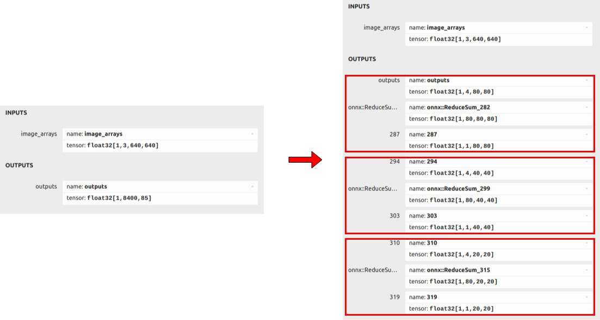
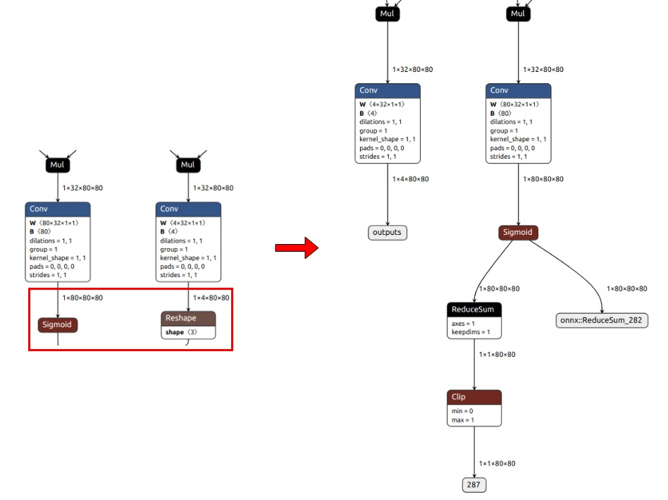
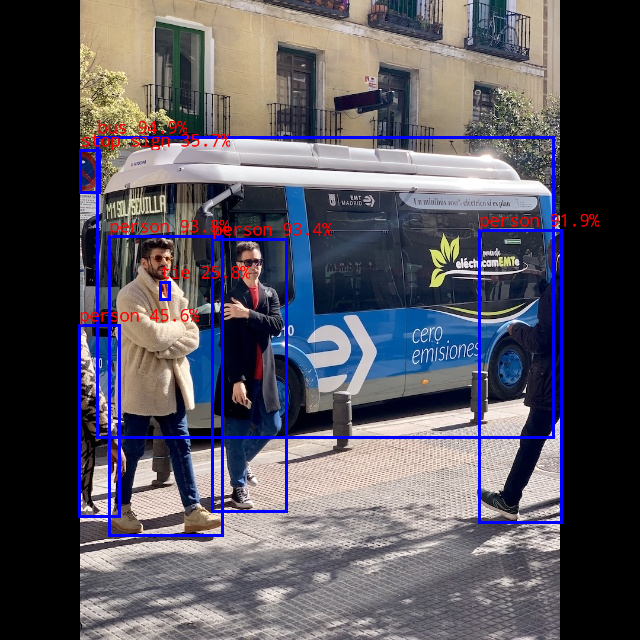

# yolov6

## Table of contents

- [1. Description](#1-description)
- [2. Current Support Platform](#2-current-support-platform)
- [3. Pretrained Model](#3-pretrained-model)
- [4. Convert to RKNN](#4-convert-to-rknn)
- [5. Python Demo](#5-python-demo)
- [6. Android Demo](#6-android-demo)
  - [6.1 Compile and Build](#61-compile-and-build)
  - [6.2 Push demo files to device](#62-push-demo-files-to-device)
  - [6.3 Run demo](#63-run-demo)
- [7. Linux Demo](#7-linux-demo)
  - [7.1 Compile and Build](#71-compile-and-build)
  - [7.2 Push demo files to device](#72-push-demo-files-to-device)
  - [7.3 Run demo](#73-run-demo)
- [8. Expected Results](#8-expected-results)


## 1. Description

This model used for object detection.

The model used in this example comes from the following open source projects:  

https://github.com/airockchip/yolov6


## 2. Current Support Platform

RK3566, RK3568, RK3588, RK3562, RK1808, RV1109, RV1126


## 3. Pretrained Model

Download link: 

[./yolov6n.onnx](https://ftrg.zbox.filez.com/v2/delivery/data/95f00b0fc900458ba134f8b180b3f7a1/examples/yolov6/yolov6n.onnx)<br />[./yolov6s.onnx](https://ftrg.zbox.filez.com/v2/delivery/data/95f00b0fc900458ba134f8b180b3f7a1/examples/yolov6/yolov6s.onnx)<br />[./yolov6m.onnx](https://ftrg.zbox.filez.com/v2/delivery/data/95f00b0fc900458ba134f8b180b3f7a1/examples/yolov6/yolov6m.onnx)

Download with shell command:

```
cd model
./download_model.sh
```

**Note**: The model provided here is an optimized model, which is different from the official original model. Take yolov6n.onnx as an example to show the difference between them.
1. The comparison of their output information is as follows. The left is the official original model, and the right is the optimized model. As shown in the figure, the original one output is split into three groups. For example, in the set of outputs ([1,4,80,80],[1,80,80,80],[1,1,80,80]), [1,4,80,80] is the coordinate of the box, [1,80,80,80] is the confidence of the box corresponding to the 80 categories, and [1,1,80,80] is the sum of the confidence of the 80 categories.

<div align=center>
  
</div>

2. Taking the the set of outputs ([1,4,80,80],[1,80,80,80],[1,1,80,80]) as an example, we remove the subgraphs behind the two convolution nodes in the model (the framed part in the figure), keep the outputs of these two convolutions ([1,4,80,80],[1,80,80,80]), and add a reducesum+clip branch for calculating the sum of the confidence of the 80 categories ([1,1,80,80]).

<div align=center>
  
</div>


## 4. Convert to RKNN

*Usage:*

```shell
cd python
python convert.py <onnx_model> <TARGET_PLATFORM> <dtype(optional)> <output_rknn_path(optional)>

# such as: 
python convert.py ../model/yolov6n.onnx rk3588
# output model will be saved as ../model/yolov6.rknn
```

*Description:*

- `<onnx_model>`: Specify ONNX model path.
- `<TARGET_PLATFORM>`: Specify NPU platform name. Support Platform refer [here](#2 Current Support Platform).
- `<dtype>(optional)`: Specify as `i8`, `u8` or `fp`. `i8`/`u8` for doing quantization, `fp` for no quantization. Default is `i8`.
- `<output_rknn_path>(optional)`: Specify save path for the RKNN model, default save in the same directory as ONNX model with name `yolov6.rknn`


## 5. Python Demo

*Usage:*

```shell
cd python
# Inference with PyTorch model or ONNX model
python yolov6.py --model_path <pt_model/onnx_model> --img_show

# Inference with RKNN model
python yolov6.py --model_path <rknn_model> --target <TARGET_PLATFORM> --img_show
```

*Description:*

- `<TARGET_PLATFORM>`: Specify NPU platform name. Support Platform refer [here](#2 Current Support Platform).

- `<pt_model / onnx_model / rknn_model>`: Specify the model path.


## 6. Android Demo

**Note: RK1808, RV1109, RV1126 does not support Android.**

#### 6.1 Compile and Build

Please refer to the [Compilation_Environment_Setup_Guide](../../docs/Compilation_Environment_Setup_Guide.md#android-platform) document to setup a cross-compilation environment and complete the compilation of C/C++ Demo.  
**Note: Please replace the model name with `yolov6`.**

#### 6.2 Push demo files to device

With device connected via USB port, push demo files to devices:

```shell
adb root
adb remount
adb push install/<TARGET_PLATFORM>_android_<ARCH>/rknn_yolov6_demo/ /data/
```

#### 6.3 Run demo

```sh
adb shell
cd /data/rknn_yolov6_demo

export LD_LIBRARY_PATH=./lib
./rknn_yolov6_demo model/yolov6.rknn model/bus.jpg
```

- After running, the result was saved as `out.png`. To check the result on host PC, pull back result referring to the following command: 

  ```sh
  adb pull /data/rknn_yolov6_demo/out.png
  ```

- Output result refer [Expected Results](#8-expected-results).


## 7. Linux Demo

#### 7.1 Compile and Build

Please refer to the [Compilation_Environment_Setup_Guide](../../docs/Compilation_Environment_Setup_Guide.md#linux-platform) document to setup a cross-compilation environment and complete the compilation of C/C++ Demo.  
**Note: Please replace the model name with `yolov6`.**

#### 7.2 Push demo files to device

- If device connected via USB port, push demo files to devices:

```shell
adb push install/<TARGET_PLATFORM>_linux_<ARCH>/rknn_yolov6_demo/ /userdata/
```

- For other boards, use `scp` or other approaches to push all files under `install/<TARGET_PLATFORM>_linux_<ARCH>/rknn_yolov6_demo/` to `userdata`.

#### 7.3 Run demo

```sh
adb shell
cd /userdata/rknn_yolov6_demo

export LD_LIBRARY_PATH=./lib
./rknn_yolov6_demo model/yolov6.rknn model/bus.jpg
```

- After running, the result was saved as `out.png`. To check the result on host PC, pull back result referring to the following command: 

  ```
  adb pull /userdata/rknn_yolov6_demo/out.png
  ```

- Output result refer [Expected Results](#8-expected-results).


## 8. Expected Results

This example will print the labels and corresponding scores of the test image detect results, as follows:

```
bus @ (97 137 553 437) 0.949
person @ (109 236 222 535) 0.938
person @ (212 239 286 511) 0.934
person @ (479 230 561 522) 0.919
person @ (79 325 119 516) 0.456
stop sign @ (80 150 99 192) 0.357
tie @ (160 282 169 299) 0.258
```



- Note: Different platforms, different versions of tools and drivers may have slightly different results.
