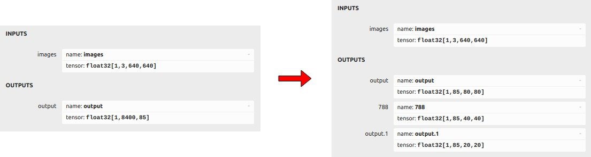
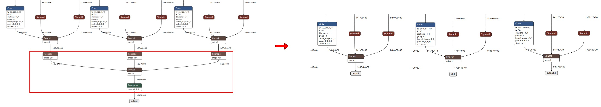
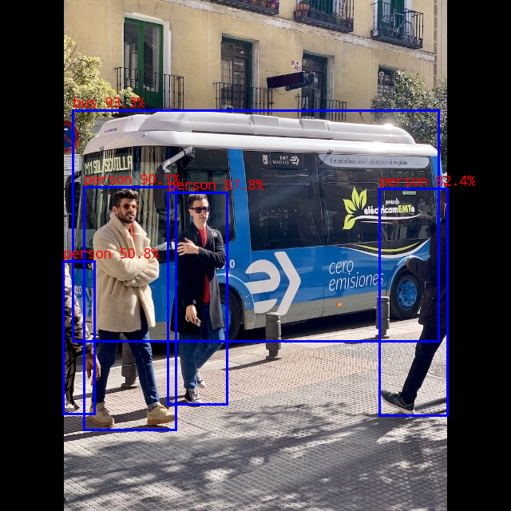

# yolox

## Table of contents

- [1. Description](#1-description)
- [2. Current Support Platform](#2-current-support-platform)
- [3. Pretrained Model](#3-pretrained-model)
- [4. Convert to RKNN](#4-convert-to-rknn)
- [5. Python Demo](#5-python-demo)
- [6. Android Demo](#6-android-demo)
  - [6.1 Compile and Build](#61-compile-and-build)
  - [6.2 Push demo files to device](#62-push-demo-files-to-device)
  - [6.3 Run demo](#63-run-demo)
- [7. Linux Demo](#7-linux-demo)
  - [7.1 Compile and Build](#71-compile-and-build)
  - [7.2 Push demo files to device](#72-push-demo-files-to-device)
  - [7.3 Run demo](#73-run-demo)
- [8. Expected Results](#8-expected-results)


## 1. Description

The model used in this example comes from the following open source projects:  

https://github.com/airockchip/YOLOX


## 2. Current Support Platform

RK3566, RK3568, RK3588, RK3562, RK1808, RV1109, RV1126


## 3. Pretrained Model

Download link: 

[./yolox_s.onnx](https://ftrg.zbox.filez.com/v2/delivery/data/95f00b0fc900458ba134f8b180b3f7a1/examples/yolox/yolox_s.onnx)<br />[./yolox_m.onnx](https://ftrg.zbox.filez.com/v2/delivery/data/95f00b0fc900458ba134f8b180b3f7a1/examples/yolox/yolox_m.onnx)

Download with shell command:

```
cd model
./download_model.sh
```

**Note**: The model provided here is an optimized model, which is different from the official original model. Take yolox_s.onnx as an example to show the difference between them.
1. The comparison of their output information is as follows. The left is the official original model, and the right is the optimized model. As shown in the figure, the original one output is split into three outputs.

<div align=center>
  
</div>

2. We remove the subgraph following the three concat nodes in the model, and keep the outputs of these three concat nodes([1,85,80,80],[1,85,40,40],[1,85,20,20]).

<div align=center>
  
</div>


## 4. Convert to RKNN

*Usage:*

```shell
cd python
python convert.py <onnx_model> <TARGET_PLATFORM> <dtype(optional)> <output_rknn_path(optional)>

# such as: 
python convert.py ../model/yolox_s.onnx rk3588
# output model will be saved as ../model/yolox.rknn
```

*Description:*

- `<onnx_model>`: Specify ONNX model path.
- `<TARGET_PLATFORM>`: Specify NPU platform name. Support Platform refer [here](#2 Current Support Platform).
- `<dtype>(optional)`: Specify as `i8`, `u8` or `fp`. `i8`/`u8` for doing quantization, `fp` for no quantization. Default is `i8`.
- `<output_rknn_path>(optional)`: Specify save path for the RKNN model, default save in the same directory as ONNX model with name `yolox.rknn`


## 5. Python Demo

*Usage:*

```shell
cd python
# Inference with PyTorch model or ONNX model
python yolox.py --model_path <pt_model/onnx_model> --img_show

# Inference with RKNN model
python yolox.py --model_path <rknn_model> --target <TARGET_PLATFORM> --img_show
```

*Description:*

- `<TARGET_PLATFORM>`: Specify NPU platform name. Support Platform refer [here](#2 Current Support Platform).

- `<pt_model / onnx_model / rknn_model>`: Specify the model path.


## 6. Android Demo

**Note: RK1808, RV1109, RV1126 does not support Android.**

#### 6.1 Compile and Build

Please refer to the [Compilation_Environment_Setup_Guide](../../docs/Compilation_Environment_Setup_Guide.md#android-platform) document to setup a cross-compilation environment and complete the compilation of C/C++ Demo.  
**Note: Please replace the model name with `yolox`.**

#### 6.2 Push demo files to device

With device connected via USB port, push demo files to devices:

```shell
adb root
adb remount
adb push install/<TARGET_PLATFORM>_android_<ARCH>/rknn_yolox_demo/ /data/
```

#### 6.3 Run demo

```sh
adb shell
cd /data/rknn_yolox_demo

export LD_LIBRARY_PATH=./lib
./rknn_yolox_demo model/yolox.rknn model/bus.jpg
```

- After running, the result was saved as `result.png`. To check the result on host PC, pull back result referring to the following command: 

  ```sh
  adb pull /data/rknn_yolox_demo/result.png
  ```

- Output result refer [Expected Results](#8-expected-results).


## 7. Linux Demo

#### 7.1 Compile and Build

Please refer to the [Compilation_Environment_Setup_Guide](../../docs/Compilation_Environment_Setup_Guide.md#linux-platform) document to setup a cross-compilation environment and complete the compilation of C/C++ Demo.  
**Note: Please replace the model name with `yolox`.**

#### 7.2 Push demo files to device

- If device connected via USB port, push demo files to devices:

```shell
adb push install/<TARGET_PLATFORM>_linux_<ARCH>/rknn_yolox_demo/ /userdata/
```

- For other boards, use `scp` or other approaches to push all files under `install/<TARGET_PLATFORM>_linux_<ARCH>/rknn_yolox_demo/` to `userdata`.

#### 7.3 Run demo

```sh
adb shell
cd /userdata/rknn_yolox_demo

export LD_LIBRARY_PATH=./lib
./rknn_yolox_demo model/yolox.rknn model/bus.jpg
```

- After running, the result was saved as `result.png`. To check the result on host PC, pull back result referring to the following command: 

  ```
  adb pull /userdata/rknn_yolox_demo/result.png
  ```

- Output result refer [Expected Results](#8-expected-results).


## 8. Expected Results

This example will print the labels and corresponding scores of the test image detection results, as follows:

```
bus @ (91 138 549 427) 0.933
person @ (105 234 220 538) 0.901
person @ (210 241 284 506) 0.878
person @ (475 236 560 520) 0.824
person @ (79 327 118 518) 0.508
```



- Note: Different platforms, different versions of tools and drivers may have slightly different results.
